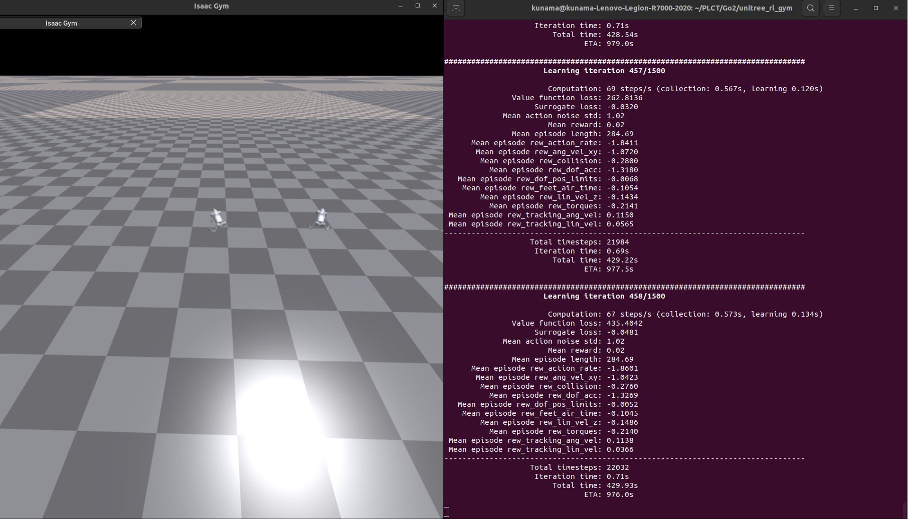
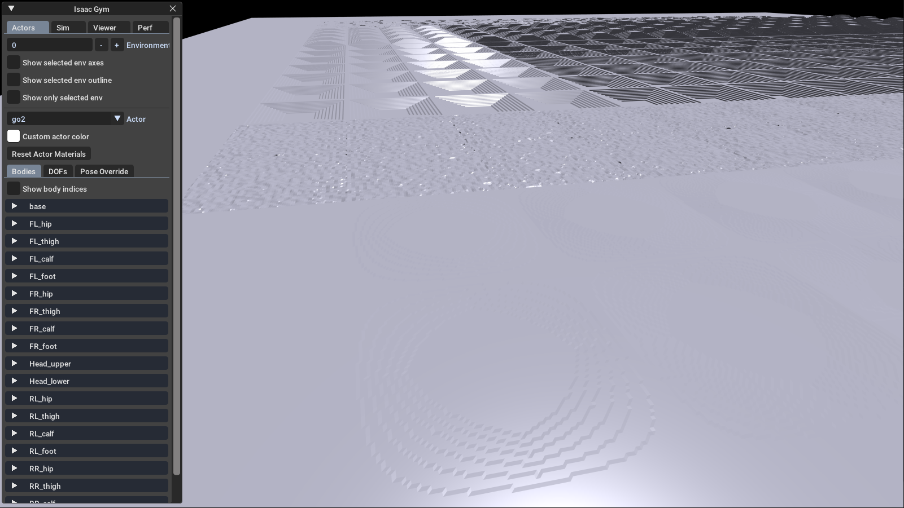
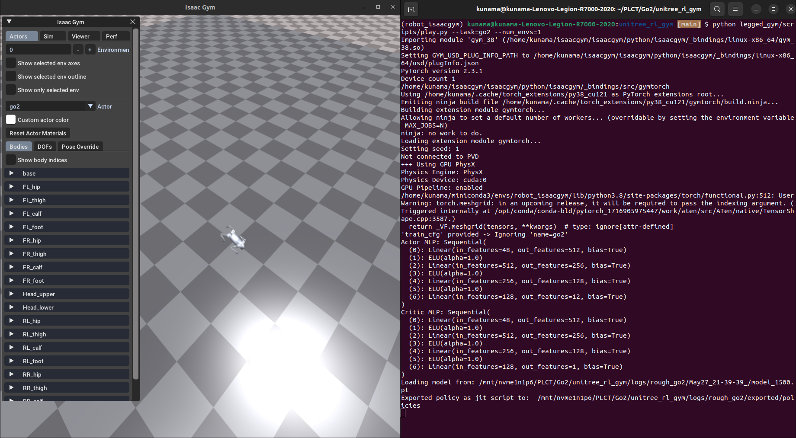

# Unitree Go2 

## Go2 on Isaac Gym Flow

System Environment：

+ Ubuntu 22.04

+ Isaac Gym 4

Official Repo：https://github.com/unitreerobotics/unitree_rl_gym/tree/main


### Unitree official train script

```python
python legged_gym/scripts/train.py --train=go2 --num_envs=2
```



+ Training Script is based on Isaac Gym Environments for Legged Robots and RSL RL

  > ## RSL RL
  >
  > A fast and simple implementation of RL algorithms, designed to run fully on GPU. This code is an evolution of `rl-pytorch` provided with NVIDIA's Isaac Gym.
  >
  > + Repo：https://github.com/leggedrobotics/rsl_rl
  >
  > ## Isaac Gym Environments for Legged Robots
  >
  > Providing the environment used to train ANYmal (and other robots) to walk on rough terrain using NVIDIA's Isaac Gym
  >
  > Including all components needed for sim-to-real transfer: actuator  network, friction & mass randomization, noisy observations and  random pushes during training.
  >
  > + Repo：https://github.com/leggedrobotics/legged_gym
  >
  > ### Important things in legged Robots
  >
  > #### `LeggedRobotCfg`
  >
  > 

+ Traning Script `go2_config.py`：

  + PPO setting：

    ```python
    class GO2RoughCfgPPO( LeggedRobotCfgPPO ):
        class algorithm( LeggedRobotCfgPPO.algorithm ):
            entropy_coef = 0.01
        class runner( LeggedRobotCfgPPO.runner ):
            run_name = ''
            experiment_name = 'rough_go2'
    ```

  + Reward :

    ```python
       class rewards( LeggedRobotCfg.rewards ):
            soft_dof_pos_limit = 0.9
            base_height_target = 0.25
            class scales( LeggedRobotCfg.rewards.scales ):
            torques = -0.0002
            dof_pos_limits = -10.0
    ```

    

  

### Unitree terrain switch 



+ Reference : https://github.com/Prcheems/Modify_the_terrain_in_Isaac_Gym


### Unitree official play script




### Unitree official sim2sim script

```
(robot_isaacgym) kunama@kunama-Lenovo-Legion-R7000-2020:unitree_rl_gym [main] $ python deploy/deploy_mujoco/deploy_mujoco.py go2.yaml
Traceback (most recent call last):
  File "deploy/deploy_mujoco/deploy_mujoco.py", line 39, in <module>
    with open(f"{LEGGED_GYM_ROOT_DIR}/deploy/deploy_mujoco/configs/{config_file}", "r") as f:
FileNotFoundError: [Errno 2] No such file or directory: '/mnt/nvme1n1p6/PLCT/Go2/unitree_rl_gym/deploy/deploy_mujoco/configs/go2.yaml'
```


## Go2 on Isaac Lab Flow

### Isaac Lab

+ Repo：https://onnxruntime.ai/docs/


## Go2 Official SDK

