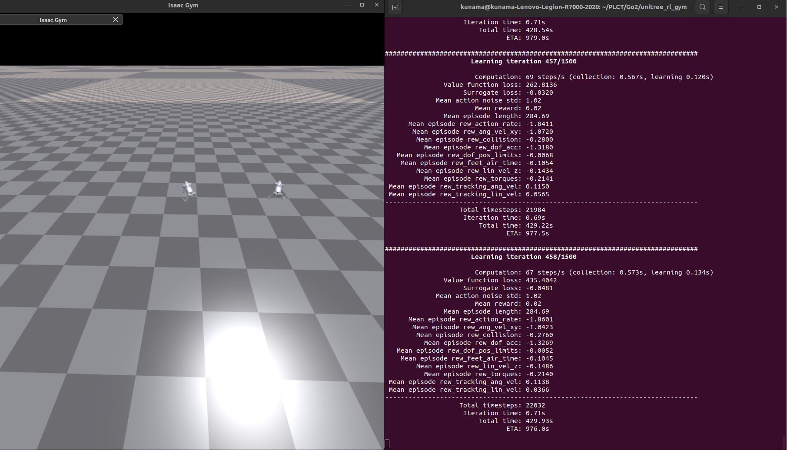
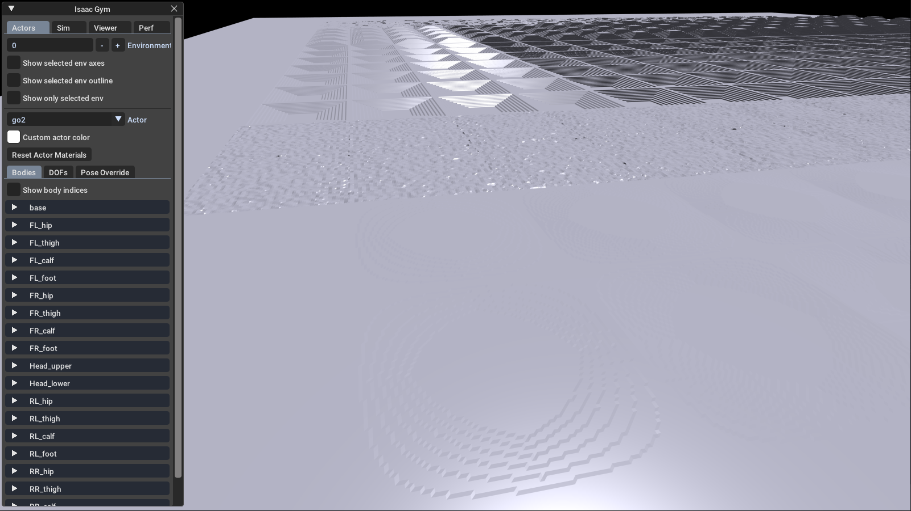
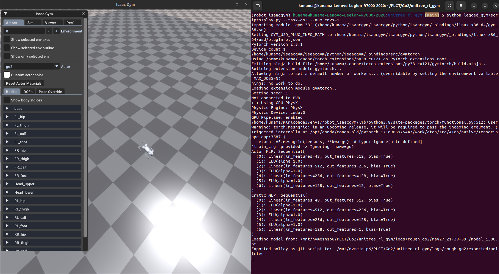

# Unitree Go2 

## Go2 on Isaac Gym Flow

Official Repo：https://github.com/unitreerobotics/unitree_rl_gym/tree/main

### Configure files

`go2_config.py`

+ `GO2RoughCfg( LeggedRobotCfg )`

  + `init_state` 初始状态

    **`pos = [0,0,0.42]`**

    - 指定机器人在重置时出生在世界坐标系的 `(x=0, y=0, z=0.42)`。
    - 默认 `LeggedRobotCfg.init_state.pos` 是 `[0,0,1.0]`，但 Go2 的机身相对较短、腿也更紧凑，常见站立高度在 0.4 m 左右，所以把出生高度调低到 0.42 m，以避免在平地或轻度崎岖地形下“悬空”过高。

    **`default_joint_angles`**

    - 当策略输出为 0 时，各条腿的“静止”/“站立”目标角度：采用一个较深的蹲姿（髋部略微抬起，股骨与地面近水平，小腿向后伸展）。
    - 这些角度能确保 Go2 的四条腿在“action=0” 时已经占据一个相对稳定的站立姿态，从而在复杂地形上能尽快接触并获得支持，而非直接过于伸直或过于塌放，导致一开始就不稳。

  + `control` 关节控制参数

    + **`control_type = 'P'`**
      - 依然选择“位置控制”模式。后端实现中会以 `τ = k_p × (target_angle − actual_angle) − k_d × velocity` 形式驱动。
      - 对 Go2 而言，较小的刚度（20 N·m/rad）配合阻尼 0.5 就足以在粗糙地形上让腿部响应平缓，不至于过度震荡。
    + **`stiffness = {'joint': 20.}`** & **`damping = {'joint': 0.5}`**
      - 定义所有可动关节（髋、膝、踝等）的通用刚度、阻尼。
      - 相比某些重型机器人（刚度 >100），Go2 采用更柔和的设置，因为其本身重量较轻、腿部也更灵活，过高刚度反而容易在崎岖地形上引起过大摆振。
    + **`action_scale = 0.25`**
      - 关系式：`target_angle = default_joint_angle + 0.25 × action`。
      - 把策略输出的 “动作值” 限定在一个较小的角度增量范围里（大约 ±0.25 rad），避免 Go2 爆发性地大幅度摆动腿部。
    + **`decimation = 4`**
      - 与仿真主步 `dt` 结合后表示：策略每输出一次动作，仿真里会执 行 4 个时钟周期的控制更新。
      - 如果仿真器 `dt = 0.005 s`，那么有效控制周期约 `0.02 s`，既保证控制频率够高，也控制策略更新频率。

  + `asset` 机器人模型

    + **`file`**
      - 指向 Go2 机器人的 URDF 文件路径（12 DoF 四足机器人）。
      - 如果要在仿真加载不同版本的 Go2，只需要把这个路径指向其他 URDF 即可。

    + **`name = "go2"`**
      - Actor 在 PhysX/Isaac Gym 中的统一命名。用于后续索引刚体与关节属性。

    + **`foot_name = "foot"`**
      - URDF 中所有脚底碰撞体节点都以 `"foot"` 命名，`LeggedRobot._create_envs()` 时会自动收集这些身体部件索引，后续用来判断“哪条腿正在接触地面”。

    + **`penalize_contacts_on = ["thigh", "calf"]`**

      - 若大腿（`thigh`）或小腿（`calf`）与地面发生碰撞，则在奖励函数里会对此环境施加惩罚。

      - 防止 Go2 的关节与地面直接“挤压碰撞”，只希望脚底来接触。

    + **`terminate_after_contacts_on = ["base"]`**

      - 如果机器人底盘（`base`）与地面发生接触，即刻判定该 environment 终止（倒地）。

      - 保证只要 Go2 一次完全“侧翻”或“翻滚”，该 episode 就结束。

    + **`self_collisions = 1`**

      - 值为 `1` 表示禁用自身各部分间的碰撞检测（bitwise 过滤）。

      - Go2 的腿部在运动时会相互靠近或短暂交叉，为了避免“腿与腿”自身误判碰撞，将自身碰撞关闭。

      - 如果设置为 `0`，则会把各个 link 间视作可碰撞，会导致很多不必要的终止。

+ `rewards`奖励函数

  + **`soft_dof_pos_limit = 0.9`**
    - 与基类同理：当某个关节位置超过了其 URDF 定义上下限的 90%（×±0.9），就开始对其离界程度给予较重惩罚。
    - 目的是防止 Go2 在崎岖地形上为避免跌倒而把关节过度拉伸到机械极限，导致机械结构损伤或动作失稳。

  + **`base_height_target = 0.25`**

    - 期望 Go2 的机身高度为 `0.25 m`（从地面到 base 正中心）。

    - 如果实际 z 坐标与 0.25 偏离，就会产生负向奖励（惩罚），鼓励其保持一个较低的、贴近地面的姿态，避免翻越高台阶或腿抬得过高反而失稳。

  + **嵌套 `scales` 字典：**

    - **`torques = -0.0002`**
      - 对输出扭矩平方值给予微弱惩罚，鼓励节能、平滑动作。
      - 由于后端关节控制是 PD 模式，这里的 torques 指的是 PD 计算出来的力矩。

    - **`dof_pos_limits = -10.0`**
      - 如果关节超出“软极限”（超过 ± 90% URDF 范围），每个关节都会触发一个较大的惩罚（按越界程度平方并累计）。
      - 这个惩罚幅度相当高（−10），保证 Go2 在任何情况下都尽量不让腿伸出安全范围，否则很快就面临 episode 终止。

`GO2RoughCfgPPO( LeggedRobotCfgPPO )`

+ **`runner`**

  + **`experiment_name = 'rough_go2'`**

    指定训练日志与检查点保存时的文件夹前缀为 `rough_go2`，便于与其他实验区分。

  + `run_name=''` 

    保持默认，表示该 run 不带额外后缀。

### train script

```python
python legged_gym/scripts/train.py --train=go2 --num_envs=2
```



+ Training Script is based on Isaac Gym Environments for Legged Robots and RSL RL

  > ## RSL RL
  >
  > A fast and simple implementation of RL algorithms, designed to run fully on GPU. This code is an evolution of `rl-pytorch` provided with NVIDIA's Isaac Gym.
  >
  > + Repo：https://github.com/leggedrobotics/rsl_rl
  >
  > ## Isaac Gym Environments for Legged Robots
  >
  > Providing the environment used to train ANYmal (and other robots) to walk on rough terrain using NVIDIA's Isaac Gym
  >
  > Including all components needed for sim-to-real transfer: actuator  network, friction & mass randomization, noisy observations and  random pushes during training.
  >
  > + Repo：https://github.com/leggedrobotics/legged_gym
  >
  > ### Important things in legged Robots
  >
  > #### `LeggedRobotCfg`
  >
  > 

+ Traning Script `go2_config.py`：

  + PPO setting：

    ```python
    class GO2RoughCfgPPO( LeggedRobotCfgPPO ):
        class algorithm( LeggedRobotCfgPPO.algorithm ):
            entropy_coef = 0.01
        class runner( LeggedRobotCfgPPO.runner ):
            run_name = ''
            experiment_name = 'rough_go2'
    ```

  + Reward :

    ```python
       class rewards( LeggedRobotCfg.rewards ):
            soft_dof_pos_limit = 0.9
            base_height_target = 0.25
            class scales( LeggedRobotCfg.rewards.scales ):
            torques = -0.0002
            dof_pos_limits = -10.0
    ```

    

  

### terrain switch 



+ Reference : https://github.com/Prcheems/Modify_the_terrain_in_Isaac_Gym


### official play script




### official sim2sim script

```
(robot_isaacgym) kunama@kunama-Lenovo-Legion-R7000-2020:unitree_rl_gym [main] $ python deploy/deploy_mujoco/deploy_mujoco.py go2.yaml
Traceback (most recent call last):
  File "deploy/deploy_mujoco/deploy_mujoco.py", line 39, in <module>
    with open(f"{LEGGED_GYM_ROOT_DIR}/deploy/deploy_mujoco/configs/{config_file}", "r") as f:
FileNotFoundError: [Errno 2] No such file or directory: '/mnt/nvme1n1p6/PLCT/Go2/unitree_rl_gym/deploy/deploy_mujoco/configs/go2.yaml'
```


## Go2 on Isaac Lab Flow

### Isaac Lab

+ Repo：https://onnxruntime.ai/docs/


## Go2 Official SDK

